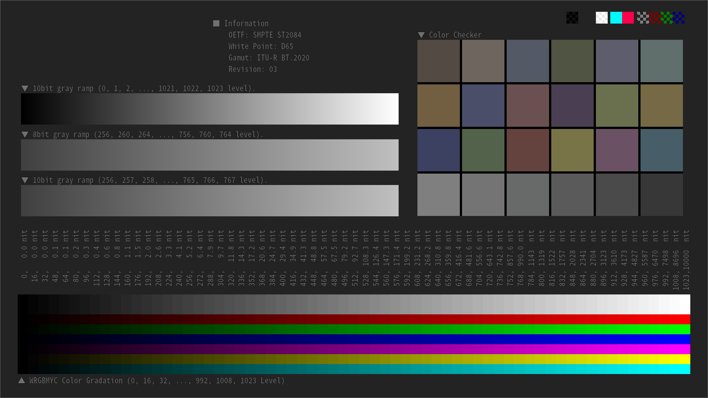
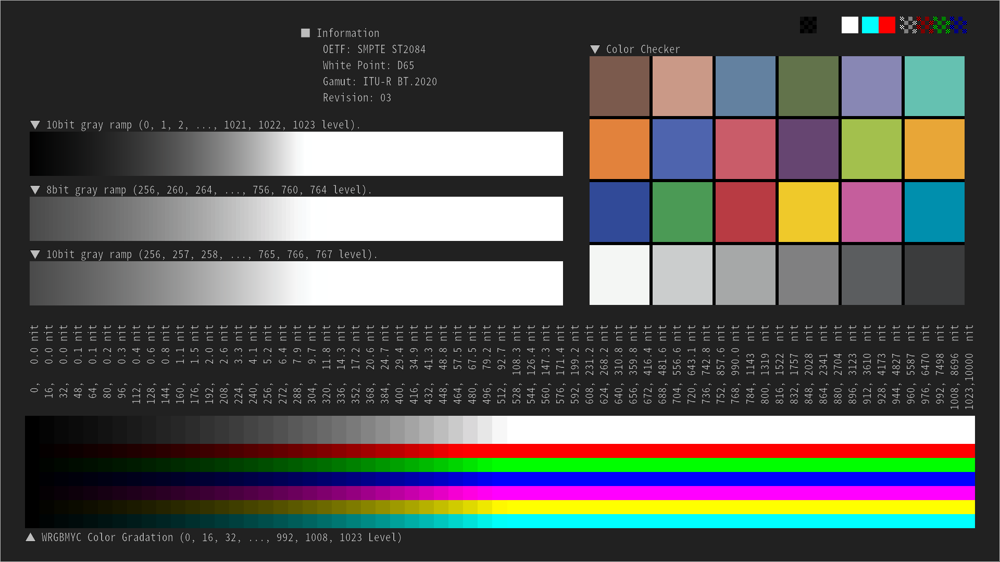

# 3DLUT を Python でサクッと作る

## 1. 目的

3DLUTデータの作り方を簡単に解説する。例として HDR(※) のデータを SDR に変換する 3DLUT を作成する。

なお、本記事は 3DLUT の作り方に特化した記事としたため基礎的な情報は省略している。3DLUT の基礎的な知識は [富士フィルムさんの資料](https://t.co/526Cc4wFYK)[1]を参照して欲しい。

※ここで言う **HDR のデータ** とは 伝達特性(Transfer Characteristics)、色域(Gamut)、白色点(White Point) がそれぞれ SMPTE ST2084, BT2020, D65 であるデータを意味する。

## 2. 結論

Python で 3DLUT を生成するサンプルコードを作成した。以下に ```main.py``` として置いてある。

ここにURLを貼る。

生成した HDR to SDR 変換の 3DLUT データを以下に示す。サイズが大きいためオリジナルは Github に「後でファイル名を決定」として置いた。

```text
# This 3DLUT data was created by TY-LUT creation tool
TITLE "cube_test"
DOMAIN_MIN 0.0 0.0 0.0
DOMAIN_MAX 1.0 1.0 1.0
LUT_3D_SIZE 65

0.0000000000e+00 0.0000000000e+00 0.0000000000e+00
2.0516382228e-02 0.0000000000e+00 0.0000000000e+00
3.6632494837e-02 0.0000000000e+00 0.0000000000e+00
5.2843508737e-02 0.0000000000e+00 0.0000000000e+00
6.9644134923e-02 0.0000000000e+00 0.0000000000e+00
8.7242266423e-02 0.0000000000e+00 0.0000000000e+00
1.0576292796e-01 0.0000000000e+00 0.0000000000e+00
1.2529901435e-01 0.0000000000e+00 0.0000000000e+00

(中略)

0.0000000000e+00 1.0000000000e+00 1.0000000000e+00
1.0000000000e+00 1.0000000000e+00 1.0000000000e+00
1.0000000000e+00 1.0000000000e+00 1.0000000000e+00
1.0000000000e+00 1.0000000000e+00 1.0000000000e+00
1.0000000000e+00 1.0000000000e+00 1.0000000000e+00
1.0000000000e+00 1.0000000000e+00 1.0000000000e+00
1.0000000000e+00 1.0000000000e+00 1.0000000000e+00
1.0000000000e+00 1.0000000000e+00 1.0000000000e+00
```

これだけだと直感的には理解しずらいため、以下2点の工夫を取り入れた csv ファイルを別に用意した。

* RGB の In と Out の関係を同じ行に表示
* 浮動小数点表記ではなく 10bit整数型で表示

結果を以下の 表1. に示す。サイズが大きいためオリジナルは Github に「後でファイル名を決定」として置いた。

|index | R_in | G_in | B_in | R_out | G_out | B_out|
|:----:|----:|----:|----:|----:|----:|----:|
|0 | 0 | 0 | 0 | 0 | 0 | 0|
|1 | 16 | 0 | 0 | 21 | 0 | 0|
|2 | 32 | 0 | 0 | 37 | 0 | 0|
|3 | 48 | 0 | 0 | 54 | 0 | 0|
|4 | 64 | 0 | 0 | 71 | 0 | 0|
|5 | 80 | 0 | 0 | 89 | 0 | 0|
|6 | 96 | 0 | 0 | 108 | 0 | 0|
|7 | 112 | 0 | 0 | 128 | 0 | 0|
|8 | 128 | 0 | 0 | 149 | 0 | 0|
| 中略 |  |  |  |  |  |  |
|274615 | 879 | 1023 | 1023 | 0 | 1023 | 1023|
|274616 | 895 | 1023 | 1023 | 0 | 1023 | 1023|
|274617 | 911 | 1023 | 1023 | 0 | 1023 | 1023|
|274618 | 927 | 1023 | 1023 | 1023 | 1023 | 1023|
|274619 | 943 | 1023 | 1023 | 1023 | 1023 | 1023|
|274620 | 959 | 1023 | 1023 | 1023 | 1023 | 1023|
|274621 | 975 | 1023 | 1023 | 1023 | 1023 | 1023|
|274622 | 991 | 1023 | 1023 | 1023 | 1023 | 1023|
|274623 | 1007 | 1023 | 1023 | 1023 | 1023 | 1023|
|274624 | 1023 | 1023 | 1023 | 1023 | 1023 | 1023|

## 3. 3DLUT の作り方

### 3.0. おおまかな手順

おおまかな手順を以下に示す。

1. 格子点数の決定
2. 格子点に相当する R, G, B データを作成
3. R, G, B データに対して所望の処理を実行
4. 変換後の R, G, B 値を LUTデータとしてテキストファイルに保存

### 3.1 格子点数の決定

3DLUT の格子点数は 17x17x17, 33x33x33, 65x65x65 など **2のべき乗+1** の値を使うケースが多い。**+1** をすることで格子点の幅が2のべき乗に近づくのが理由だと筆者は考えている。

具体例を提示しよう。17x17x17 と 16x16x16 の格子点に相当する Code Value を 10bit の整数型で表示すると以下となる。

```text
17x17x17 の場合
0   64  128  192  256  320  384  448  512  575  639  703  767  831  895  959  1023

16x16x16 の場合
0   68  136  205  273  341  409  477  546  614  682  750  818  887  955  1023
```

直感的に 17x17x17 の方が具合が良さそうなのが分かると思う(※)。

なお、当然のことだが格子点数を増やすと精度は良くなるがパフォーマンスは悪くなる。今回はパフォーマンスを気にする必要が無いので精度を重視して 65x65x65 で作成することにする。

※主観的な書き方でゴメンナサイ。

### 3.2. 格子点に相当する R, G, B データを作成

格子点数が決定したら各格子点に相当する R, G, B のデータを作成する。この作業は 1.結論 の 表1. の ```R_in, G_in, B_in``` のデータを作ることに相当する。

ここからは先はプログラムを使わないと実現が難しいため Pythonコードを使って解説していく。まず筆者が作成したサンプルコードを示す。このコードを実行することで格子点データが作成できる。

```python
def make_3dlut_grid(grid_num=65):
    # np.meshgrid を使って 3次元の格子点座標を生成
    x = np.linspace(0, 1, grid_num)
    rgb_mesh_array = np.meshgrid(x, x, x)

    # 後の処理を行いやすくするため shape を変える
    rgb_mesh_array = [x.reshape(1, grid_num ** 3, 1) for x in rgb_mesh_array]

    # 格子点のデータ増加が R, G, B の順となるように配列を並べ替えてから
    # np.dstack を使って結合する
    rgb_grid = np.dstack(
        (rgb_mesh_array[2], rgb_mesh_array[0], rgb_mesh_array[1]))

    return rgb_grid
```

ポイントは以下の2点。

1. ```np.meshgrid``` を使って3次元の格子点を作成している[2]
2. 格子点のデータが R, G, B の順に増加するようにしている
3. 最大値が ```1.0``` となるように正規化している

念のため 2. について補足しておく。格子点数が 3x3x3 の場合の ```make_3dlut_grid``` の出力の実例を以下に示す。

```python
>>> make_3dlut.make_3dlut_grid(grid_num=3)
array([[[ 0. ,  0. ,  0. ],
        [ 0.5,  0. ,  0. ],
        [ 1. ,  0. ,  0. ],
        [ 0. ,  0.5,  0. ],
        [ 0.5,  0.5,  0. ],
        [ 1. ,  0.5,  0. ],
        [ 0. ,  1. ,  0. ],
        [ 0.5,  1. ,  0. ],
        [ 1. ,  1. ,  0. ],
        [ 0. ,  0. ,  0.5],
        [ 0.5,  0. ,  0.5],
        [ 1. ,  0. ,  0.5],
        [ 0. ,  0.5,  0.5],
        [ 0.5,  0.5,  0.5],
        [ 1. ,  0.5,  0.5],
        [ 0. ,  1. ,  0.5],
        [ 0.5,  1. ,  0.5],
        [ 1. ,  1. ,  0.5],
        [ 0. ,  0. ,  1. ],
        [ 0.5,  0. ,  1. ],
        [ 1. ,  0. ,  1. ],
        [ 0. ,  0.5,  1. ],
        [ 0.5,  0.5,  1. ],
        [ 1. ,  0.5,  1. ],
        [ 0. ,  1. ,  1. ],
        [ 0.5,  1. ,  1. ],
        [ 1. ,  1. ,  1. ]]])
```

R, G, B の順にデータが増加していることが分かると思う。なお、行数の関係で格子点数を 3x3x3 としている。この順序にした理由は後述する 3DLUTフォーマットの1つである Cube 形式の増加順序に合わせたためである。

まとめると ```make_3dlut_grid(grid_num=65)``` を実行することで 65x65x65 点の 3DLUT の格子点データを作成できる。

### 3.3. R, G, B データに対して所望の処理を実行

格子点の代表値のデータが準備できたら、R, G, B データに対して所望の処理(今回の例だと Gamma2.4-BT709-D65 への変換が該当)を実行する。これは 1.結論 の 表1. の ```R_out, G_out, B_out``` のデータを作ることに相当する。

今回のサンプルでは以下の書き方となる。具体的な変換処理は外部ライブラリの Colour Science for Python[3] を利用した。

```python
    # R, G, B の grid point データを準備
    x = make_3dlut_grid(grid_num=grid_num)

    # linear に戻す
    linear_luminance = eotf_ST2084(x)

    # 単位が輝度(0～10000 nits)になっているので
    # 一般的に使われる 1.0 が 100 nits のスケールに変換
    linear = linear_luminance / NOMINAL_WHITE_LUMINANCE

    # 色域を BT.2020 --> BT.709 に変換
    linear_bt709 = RGB_to_RGB(RGB=linear,
                              input_colourspace=BT2020_COLOURSPACE,
                              output_colourspace=BT709_COLOURSPACE)

    # BT.709 の範囲外の値(linear_bt709 < 0.0 と linear_bt709 > 1.0 の領域)をクリップ
    linear_bt709 = np.clip(linear_bt709, 0.0, 1.0)

    # BT.709 のガンマ(OETF)をかける
    non_linear_bt709 = linear_bt709 ** (1 / 2.4)
```

### 3.4. 変換後の R, G, B 値を LUTデータとしてテキストファイルに保存

LUT値が計算できたら Davinci Resolve 等の各種ツールで読み込めるよう Adobe の Cube 形式[4]でファイルに保存する。Cube 形式を採用したのは広く使われているからである。例えば SONY の S-Log3/S-Gamut3 や キヤノンの CinemaGamut/CanonLog3 を変換する 3DLUT は Cube 形式て提供されている[5][6]。

```python
    # 自作の LUTライブラリのクソ仕様のため shape を変換する
    lut_for_save = non_linear_bt709.reshape((grid_num ** 3, 3))

    # .cube の形式で保存
    lut_fname = "./st2084_bt2020_to_gamma2.4_bt709.cube"
    lut.save_3dlut(
        lut=lut_for_save, grid_num=grid_num, filename=lut_fname)
```

Cube 形式のファイルの中身は 2.結論 で示した通りである。

## 4. 3DLUT をテストパターン画像に適用

作成した 3DLUT を検証用テストパターンに適用した結果を示しておく。以下の図は 3DLUT を使って HDR のテストパターンを SDR に変換したものである。なお、3DLUT の適用には Davinci Resolve を使用した。

| ソース画像 | 3DLUT を使い変換した結果 |
|:---------:|:---------:|
|||

右上のカラーチェッカーおよび下部のグレースケールを見ると、正しそうなことが分かる。本来なら目視による評価だけでなく定量的に正しいか判断するのだが、記事が長くなるので目視確認のみとする。

## 5. おことわり

今回作成した 3DLUT は Tone Mapping や Gamut Mapping などの最適化処理は一切実施していない。単純な数値変換を行っただけである。そのため、実コンテンツに対して ST2084, BT2020, D65 to  Gamma2.4, BT709, D65 変換すると白飛びなどのアーティファクトが多数発生してしまう。あくまでも 3DLUT の一例として捉えて欲しい。

## 6. 参考資料

[1] FUJIFILM, "3DLUT作成のサンプルコードの作成", http://fujifilm.jp/business/broadcastcinema/solution/color_management/is-mini/promotion/pack/pdf/news/20150122_jppa.pdf (2019/08/12 リンク切れを確認。Internet Archive → https://t.co/526Cc4wFYK)

[2] 吉田拓真, 尾原颯, "現場で使える！NumPyデータ処理入門", 初版, 翔泳社, 536p, 978-4798155913.

[3] colour-science, "colour", https://github.com/colour-science/colour.

[4] Adobe Systems, "Cube LUT Specification Version 1.0", https://wwwimages2.adobe.com/content/dam/acom/en/products/speedgrade/cc/pdfs/cube-lut-specification-1.0.pdf

[5] SONY, "S-Gamut 3.Cine/S-Log3", http://support.d-imaging.sony.co.jp/download/NEX/ciOkozszIz/Look_profile_for_resolve_S-Gamut3.cine_Slog3.zip?fm=ja (2019/08/13 確認)

[6] CANON, "Canon lookup table 201902版", https://cweb.canon.jp/drv-upd/dvc/canon-lut-201902.html (2019/08/13 確認)
