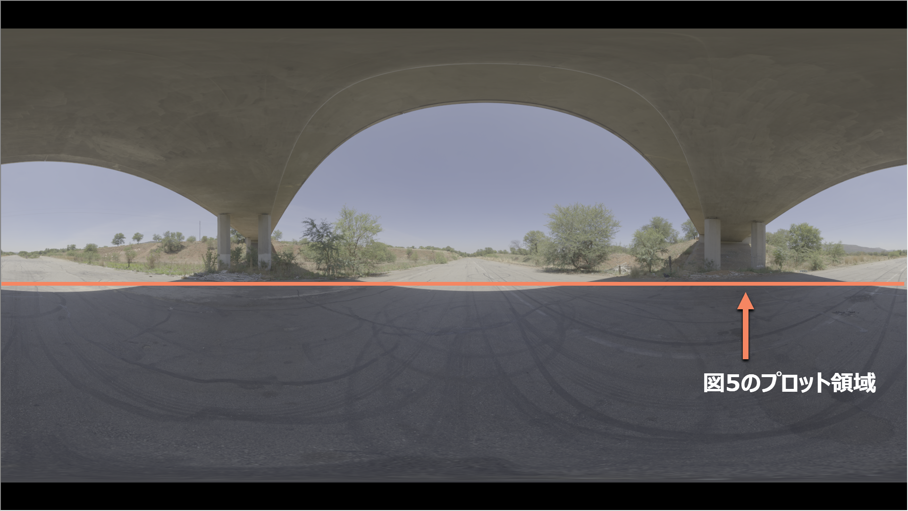
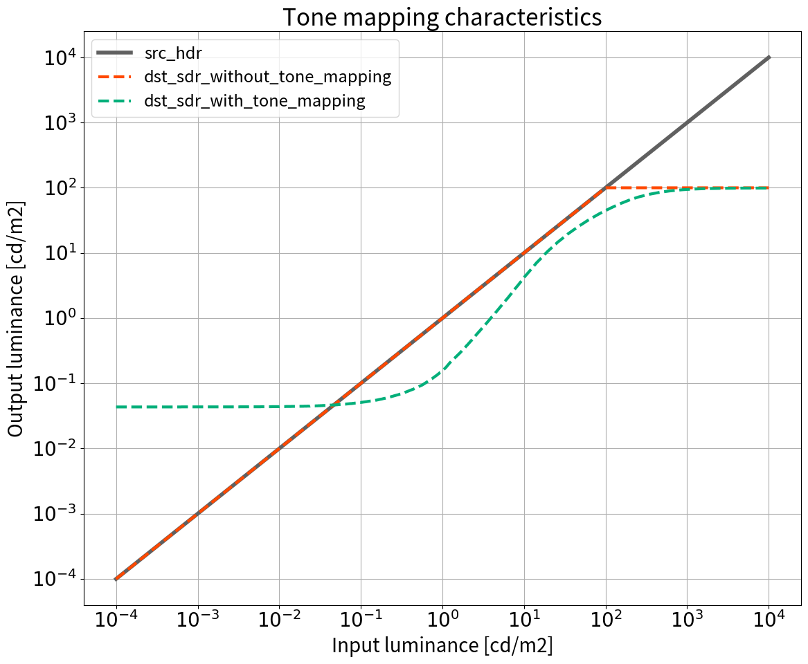
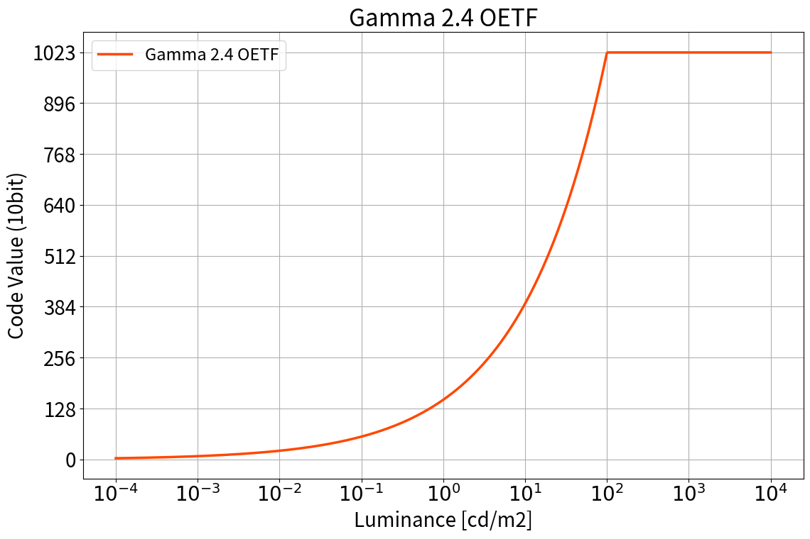

# HDR to SDR 変換の紹介

## 1. 目的

* HDR(※1) to SDR 変換には大きく分けて 4 Step あることを紹介する
* 筆者が [以前の記事](https://trev16.hatenablog.com/entry/2019/08/13/200541) で作成した 3DLUT は一部の step を省略した簡略型であることを示す

※1 本記事で扱う HDR 信号はコンシューマ向けの HDRビデオ信号(HDR10)を想定しています。業務用の HDR ビデオ信号(ACESなど)は想定していません。

## 2. 背景

前回投稿した記事 [Python を利用した簡単な 3DLUT の作成](https://trev16.hatenablog.com/entry/2019/08/13/200541) にて、筆者は以下の記述をした。

> 今回作成した 3DLUT は Tone Mapping や Gamut Mapping などの最適化処理は一切実施していない。単純な数値変換を行っただけである。そのため、実コンテンツに対して ST2084, BT2020, D65 to Gamma2.4, BT709, D65 変換すると白飛びなどのアーティファクトが多数発生してしまう。

Twitter で「この部分が気になる」とのご指摘を受け、「たしかに適当にお茶を濁した書き方で良くないな」と改めて実感したので補足資料を作ることにした。

## 3. 結論

### 3.1. HDR to SDR 変換の 4 Step

多くの HDR to SDR 変換は以下の 4 Step で行われる(※2)。ブロック図を図1に示す。

1. EOTF の適用による HDR の Code Value 値から輝度値(Linear値)への変換
2. Tone Mapping, Gamut Mapping の適用による 輝度・色度の変換
3. 3x3 Matrix の適用による、BT2020 to BT709 の色域変換
4. OETF の適用による輝度値(Linear値)から SDR の Code Value 値への変換


※2 2点の資料[1][2]および経験を元に筆者が独自にまとめた。同然だがこれ以外のパターンも存在する。

### 3.2. 以前の記事で作成した 3DLUT が簡略型であることの提示

筆者が以前に作成した 3DLUT は Step1～4 のうち Step2 を省略した簡略型であった。Tone Mapping, Gamut Mapping を実行していないため白飛びが多数発生する。すべての Step を実行した場合との比較を図2に示す。

| 説明 | コンテンツ[3] |
|:----|:------------|
|オリジナル(HDR10)||
|SDR変換(Step2 を省略)||
|SDR変換(全Step実行)||

## 4. 解説

### 4.1. HDR to SDR 変換の 4 Step について

ここでは この 4 Step の必要性と具体的な内部処理について解説する。

#### 4.1.0. 前程知識

まずは、前提知識として輝度と符号化の話をする。

コンシューマ向けのHDR信号の多くは、各ピクセルの輝度情報が SMPTE ST2084(PQカーブ)という方式で 10bit 整数型 に **符号化** されている。例を 図3 に示す。例えば 10000cd/m2 の明るさを持つ白色のピクセルは ```(R, G, B) = (1023, 1023, 1023)```、 100cd/m2 のピクセルは ```(R, G, B) = (520, 520, 520)``` に符号化される。この符号化処理を **OETF(Opto Electronic Transfer Function)** と呼ぶ。


符号化されたデータは元の輝度情報と比較すると非線形な特性を持つ。そのため画像処理を行う場合には事前に **復号化**(※3) するのが好ましい。

※3 non-linear の信号を linear に変換する、と表現することも多い

#### 4.1.1. Step1

さて、ようやく Step1 の話に入れる。Step1 は ST2084 で符号化された情報を復号化する処理である。これは図3 の処理の逆関数に相当する。例えば ```(R, G, B) = (1023, 1023, 1023)``` のピクセルは ```(R, G, B) = (10000, 10000, 10000)``` という値に変換される。この復号化処理を **EOTF(Electro Optical Transfer Function)** と呼ぶ。

#### 4.1.2. Step2

Step2 では Tone Mapping, Gamut Mapping の2種類が登場するが、ここでは Tone Mapping について解説する(※4)。Tone Mapping の役割は **破綻が少なくなるように** HDRレンジの輝度情報をSDRレンジに変換することである。

ここで言う **破綻** について具体例を使って説明する。2.結論の 図2 の2枚目、3枚目を改めて見て欲しい。2枚目 の Tone Mapping なし版では、白飛びが多数発生して破綻しているが、3枚目は Tone Mapping の効果により破綻が抑えられている。

続いて Tone Mapping の具体的な処理内容を 図4 で説明する。図4 の緑線を見ると Tone Mapping では 1000cd/m2 付近までの輝度情報使って SDR の絵を再構成している。これにより破綻を抑えた SDRレンジへの変換が実現できている。一方で、Tone Mapping をしない橙線を見ると 100cd/m2 より上の輝度情報をバッサリとクリッピングしているのが分かる。これにより極端な絵の破綻が発生している。



参考までに図2 に横線でマーキングした箇所の輝度情報を図5にプロットした。Tone Mapping を使った場合はディテールが消えずに残っていることが読み取れる。


※4 Gamut Mapping については別資料を参照して頂きたい[4][5]。

#### 4.1.3. Step3

Step3 では色域の変換(BT2020 to BT709)を 3x3 の Matrix を使って行う。

#### 4.1.4. Step4

Step4 では 輝度情報を SDR の規格に従って **符号化** する。基本的には Step1 の逆変換だと考えれば良い。大きな違いは次の2点である。

* OETF は ST2084 ではなく Gamma2.4 を使う (※5)
* SDR のレンジで表現できない 100cd/m2 より上の情報はクリッピングする

変換の例を図6に示す。100cd/m2 までの情報を 0～1023 の値で符号化していることが分かる。



※5 死ぬほど分かりにくくて申し訳ないが OETF なので実際の計算式は ```y = x^(1/2.4)``` となる

#### 4.1.5. まとめ

以上の 4 step により、HDR の信号が SDR の信号へと変換される。この中で必須の処理は Step1, Step3, Step4 の3つである。Step2 は省略しても変換処理は完了するが、白飛びなどの破綻が目につくので推奨はしない。

#### 5. 備考

今回の検証で使った Tone Mapping, Gamut Mapping は SONYさんが作成[6]した ```SLog3SGamut3.CineToLC-709TypeA.cube``` を HDR10 用に改造して使いました。変な使い方をしてしまってスミマセン。

#### 6. 感想

3行くらいで書き終わると思って気軽に始めたが、気づいたら結構な量になってしまった。過不足無くコンパクトに記事を書くのは難しい。もっと修練せねば。

## 7. 参考資料

[1] ITU-R BT.2390-6, "High dynamic range television for production and international programme exchange", https://www.itu.int/dms_pub/itu-r/opb/rep/R-REP-BT.2390-6-2019-PDF-E.pdf

[2] Ultra HD Forum, "Ultra HD Forum Guidelines, Revision: 2.0", https://ultrahdforum.org/wp-content/uploads/Ultra-HD-Forum-Guidelines-v2.0.pdf

[3] HDRI Haven, "Derelict Underpass", https://hdrihaven.com/hdri/?c=urban&h=derelict_underpass

[4] ITU-R BT.2047-0, "Colour gamut conversion from Recommendation ITU-R BT.2020 to Recommendation ITU-R BT.709", https://www.itu.int/dms_pub/itu-r/opb/rep/R-REP-BT.2407-2017-PDF-E.pdf

[5] Ihor Szlachtycz, "Using AMD FreeSync 2 HDR: Gamut Mapping", https://gpuopen.com/using-amd-freesync-2-hdr-gamut-mapping/

[6] SONY, "S-Gamut 3.Cine/S-Log3", http://support.d-imaging.sony.co.jp/download/NEX/ciOkozszIz/Look_profile_for_resolve_S-Gamut3.cine_Slog3.zip?fm=ja (2019/08/18 確認)

[参照なし] コンポジゴク, "ガンマについて", http://compojigoku.blog.fc2.com/blog-entry-23.html
